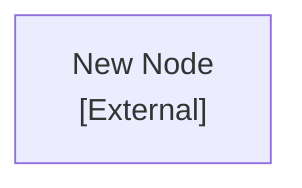

# Unnamed CodeViz Diagram

```mermaid
graph TD

    node-1777001109135["New Node<br>[External]"]

```
# Unnamed CodeViz Diagram

```mermaid
graph TD

    base.cv::user["**User**<br>[External]"]
    base.cv::frontend_app["**Frontend Application**<br>package.json `react`, src/main.jsx `ReactDOM.createRoot`"]
    base.cv::data_orchestrator["**Data Pipeline Orchestrator**<br>scripts/orchestrator.py `main`"]
    base.cv::us_census_bureau["**US Census Bureau API**<br>scripts/fetchers/fetch_acs.py `BASE`"]
    base.cv::chicago_pd_api["**Chicago Police Department API**<br>scripts/fetchers/fetch_cpd.py `fetch_cpd`"]
    base.cv::cook_county_assessor_api["**Cook County Assessor API**<br>scripts/fetchers/fetch_assessor.py `fetch_assessor`"]
    base.cv::chicago_311_api["**Chicago 311 API**<br>scripts/fetchers/fetch_311.py `fetch_311`"]
    base.cv::chicago_cta_api["**Chicago CTA API**<br>scripts/fetchers/fetch_cta.py `fetch_cta`"]
    base.cv::chicago_parks_api["**Chicago Park District API**<br>scripts/fetchers/fetch_parks.py `fetch_parks`"]
    base.cv::cook_county_treasurer_api["**Cook County Treasurer API**<br>scripts/fetchers/fetch_treasurer.py `fetch_treasurer`"]
    base.cv::airnow_api["**AirNow API**<br>src/lib/api/airnow.js `fetchAirNowData`"]
    base.cv::fema_api["**FEMA API**<br>src/lib/api/fema.js `fetchFemaData`"]
    base.cv::google_maps_api["**Google Maps API**<br>src/lib/api/google-maps.js `loadGoogleMapsScript`"]
    base.cv::google_places_api["**Google Places API**<br>src/lib/api/google-places.js `getPlaceDetails`"]
    base.cv::howloud_api["**HowLoud API**<br>src/lib/api/howloud.js `fetchHowloudData`"]
    base.cv::illinois_report_card_api["**Illinois Report Card API**<br>src/lib/api/illinois-report-card.js `fetchSchoolData`"]
    base.cv::mapbox_api["**Mapbox API**<br>src/lib/api/mapbox.js `createMap`"]
    base.cv::rentcast_api["**RentCast API**<br>src/lib/api/rentcast.js `fetchRentcastData`"]
    base.cv::spothero_api["**SpotHero API**<br>src/lib/api/spothero.js `fetchSpotHeroData`"]
    base.cv::yelp_api["**Yelp API**<br>src/lib/api/yelp.js `fetchYelpData`"]
    subgraph base.cv::supabase_project_boundary["**Supabase Project**<br>[External]"]
        base.cv::supabase_db["**Supabase Database**<br>supabase/migrations/001_create_tables.sql `CREATE TABLE`, supabase/seed/ `seed.sql`"]
        base.cv::supabase_functions["**Supabase Edge Functions**<br>supabase/functions/ `index.ts`"]
    end
    %% Edges at this level (grouped by source)
    base.cv::user["**User**<br>[External]"] -->|"Uses"| base.cv::frontend_app["**Frontend Application**<br>package.json `react`, src/main.jsx `ReactDOM.createRoot`"]
    base.cv::frontend_app["**Frontend Application**<br>package.json `react`, src/main.jsx `ReactDOM.createRoot`"] -->|"Authenticates and fetches data from"| base.cv::supabase_db["**Supabase Database**<br>supabase/migrations/001_create_tables.sql `CREATE TABLE`, supabase/seed/ `seed.sql`"]
    base.cv::frontend_app["**Frontend Application**<br>package.json `react`, src/main.jsx `ReactDOM.createRoot`"] -->|"Invokes"| base.cv::supabase_functions["**Supabase Edge Functions**<br>supabase/functions/ `index.ts`"]
    base.cv::frontend_app["**Frontend Application**<br>package.json `react`, src/main.jsx `ReactDOM.createRoot`"] -->|"Fetches data from"| base.cv::airnow_api["**AirNow API**<br>src/lib/api/airnow.js `fetchAirNowData`"]
    base.cv::frontend_app["**Frontend Application**<br>package.json `react`, src/main.jsx `ReactDOM.createRoot`"] -->|"Fetches data from"| base.cv::fema_api["**FEMA API**<br>src/lib/api/fema.js `fetchFemaData`"]
    base.cv::frontend_app["**Frontend Application**<br>package.json `react`, src/main.jsx `ReactDOM.createRoot`"] -->|"Uses"| base.cv::google_maps_api["**Google Maps API**<br>src/lib/api/google-maps.js `loadGoogleMapsScript`"]
    base.cv::frontend_app["**Frontend Application**<br>package.json `react`, src/main.jsx `ReactDOM.createRoot`"] -->|"Fetches data from"| base.cv::google_places_api["**Google Places API**<br>src/lib/api/google-places.js `getPlaceDetails`"]
    base.cv::frontend_app["**Frontend Application**<br>package.json `react`, src/main.jsx `ReactDOM.createRoot`"] -->|"Fetches data from"| base.cv::howloud_api["**HowLoud API**<br>src/lib/api/howloud.js `fetchHowloudData`"]
    base.cv::frontend_app["**Frontend Application**<br>package.json `react`, src/main.jsx `ReactDOM.createRoot`"] -->|"Fetches data from"| base.cv::illinois_report_card_api["**Illinois Report Card API**<br>src/lib/api/illinois-report-card.js `fetchSchoolData`"]
    base.cv::frontend_app["**Frontend Application**<br>package.json `react`, src/main.jsx `ReactDOM.createRoot`"] -->|"Uses"| base.cv::mapbox_api["**Mapbox API**<br>src/lib/api/mapbox.js `createMap`"]
    base.cv::frontend_app["**Frontend Application**<br>package.json `react`, src/main.jsx `ReactDOM.createRoot`"] -->|"Fetches data from"| base.cv::rentcast_api["**RentCast API**<br>src/lib/api/rentcast.js `fetchRentcastData`"]
    base.cv::frontend_app["**Frontend Application**<br>package.json `react`, src/main.jsx `ReactDOM.createRoot`"] -->|"Fetches data from"| base.cv::spothero_api["**SpotHero API**<br>src/lib/api/spothero.js `fetchSpotHeroData`"]
    base.cv::frontend_app["**Frontend Application**<br>package.json `react`, src/main.jsx `ReactDOM.createRoot`"] -->|"Fetches data from"| base.cv::yelp_api["**Yelp API**<br>src/lib/api/yelp.js `fetchYelpData`"]
    base.cv::data_orchestrator["**Data Pipeline Orchestrator**<br>scripts/orchestrator.py `main`"] -->|"Reads/Writes data to"| base.cv::supabase_db["**Supabase Database**<br>supabase/migrations/001_create_tables.sql `CREATE TABLE`, supabase/seed/ `seed.sql`"]
    base.cv::data_orchestrator["**Data Pipeline Orchestrator**<br>scripts/orchestrator.py `main`"] -->|"Can invoke (e.g., for transformations)"| base.cv::supabase_functions["**Supabase Edge Functions**<br>supabase/functions/ `index.ts`"]
    base.cv::data_orchestrator["**Data Pipeline Orchestrator**<br>scripts/orchestrator.py `main`"] -->|"Fetches data from"| base.cv::us_census_bureau["**US Census Bureau API**<br>scripts/fetchers/fetch_acs.py `BASE`"]
    base.cv::data_orchestrator["**Data Pipeline Orchestrator**<br>scripts/orchestrator.py `main`"] -->|"Fetches data from"| base.cv::chicago_pd_api["**Chicago Police Department API**<br>scripts/fetchers/fetch_cpd.py `fetch_cpd`"]
    base.cv::data_orchestrator["**Data Pipeline Orchestrator**<br>scripts/orchestrator.py `main`"] -->|"Fetches data from"| base.cv::cook_county_assessor_api["**Cook County Assessor API**<br>scripts/fetchers/fetch_assessor.py `fetch_assessor`"]
    base.cv::data_orchestrator["**Data Pipeline Orchestrator**<br>scripts/orchestrator.py `main`"] -->|"Fetches data from"| base.cv::chicago_311_api["**Chicago 311 API**<br>scripts/fetchers/fetch_311.py `fetch_311`"]
    base.cv::data_orchestrator["**Data Pipeline Orchestrator**<br>scripts/orchestrator.py `main`"] -->|"Fetches data from"| base.cv::chicago_cta_api["**Chicago CTA API**<br>scripts/fetchers/fetch_cta.py `fetch_cta`"]
    base.cv::data_orchestrator["**Data Pipeline Orchestrator**<br>scripts/orchestrator.py `main`"] -->|"Fetches data from"| base.cv::chicago_parks_api["**Chicago Park District API**<br>scripts/fetchers/fetch_parks.py `fetch_parks`"]
    base.cv::data_orchestrator["**Data Pipeline Orchestrator**<br>scripts/orchestrator.py `main`"] -->|"Fetches data from"| base.cv::cook_county_treasurer_api["**Cook County Treasurer API**<br>scripts/fetchers/fetch_treasurer.py `fetch_treasurer`"]

```
---
*Generated by [CodeViz.ai](https://codeviz.ai) on 4/23/2026, 10:25:29 PM*
